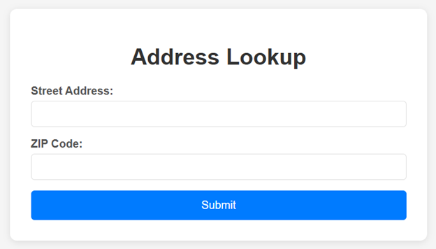

## Purpose
This app is meant for St. Louis County Library staff to simplify the process of finding the geographic code and patron type for patron registration.

## Benefits
Staff can find the proper geographic code and patron type by entering a street address and ZIP code into a form. This simplifies the library card registration process for staff by eliminating the need to use the USPS website, the St. Louis County Real Estate Search, and the GreatSchools website. The app checks the address with data from the United States Census Bureau, Google Maps, St. Louis County, and Jefferson County to determine proper registration info.

## Usage Instructions
### Submitting the Form
- Go to the app website: [registrationfinder.onrender.com](https://registrationfinder.onrender.com/)
- Enter the street address (apartment number not required)
- Enter the ZIP Code
- Click “Submit”  

## Output
Displays the following fields:

### Results
- Returned Address
- Geographic Code
- Patron Type

### Details
- County (or city if in Washington, MO)
- Library District (if in St. Louis County)
- School District (if in Jefferson County)

## How It Works
### Verifying the Address
The program first validates the address by checking it against the most current United States Census Bureau data.  If the address is not found, the program checks the address with Google Maps data.

### Finding Geographic Code and Patron Type
- If there is only one possible geographic code and patron type for the ZIP code, the program returns the result. 

- Otherwise, if the geographic code and patron type can be inferred from the county alone (or the city in the case of Washington Public Library), the program stops there. The county is checked against csv_files/PatronTypes.csv, which contains all counties eligible for a library card.

- If the address is in St. Louis County, the program checks St. Louis County data to see which library the address pays taxes to. 

- If the address is in Jefferson County, the program checks Jefferson County data to see which school district the residence is in.

- If the address does not fall into any of these categories, the address is determined to be ineligible for a library card.

### Hosting the App
The app is made accessible on the internet by [Render](https://render.com/).

### Data Sources
[United States Census Bureau](https://www.census.gov/)
- [Census Geocoder](https://geocoding.geo.census.gov/geocoder/)

[Google Maps Platform](https://developers.google.com/maps)
- [Geocoding API](https://developers.google.com/maps/documentation/geocoding)

[Esri Federal Data](https://www.arcgis.com/home/item.html?id=1b63e857b9594fcaa6f64445f6844526)
- [Counties](https://services2.arcgis.com/FiaPA4ga0iQKduv3/ArcGIS/rest/services/TIGERweb_Counties_v1/FeatureServer/0)

[Saint Louis County ArcGIS Site](https://data-stlcogis.opendata.arcgis.com/)
- [Library Districts](https://services2.arcgis.com/w657bnjzrjguNyOy/ArcGIS/rest/services/AGS_Jurisdictions/FeatureServer/8)

[Jefferson County ArcGIS Site](https://jeffersoncomo.maps.arcgis.com/home/index.html)
- [School](https://services1.arcgis.com/Ur3TPhgM56qvxaar/arcgis/rest/services/Tax_Districts/FeatureServer/0)

